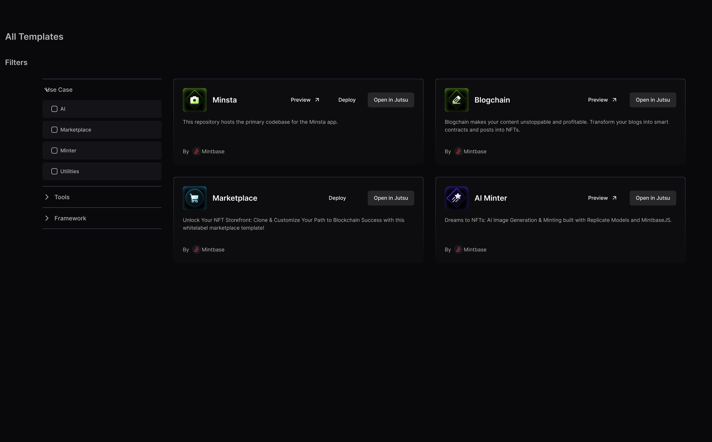
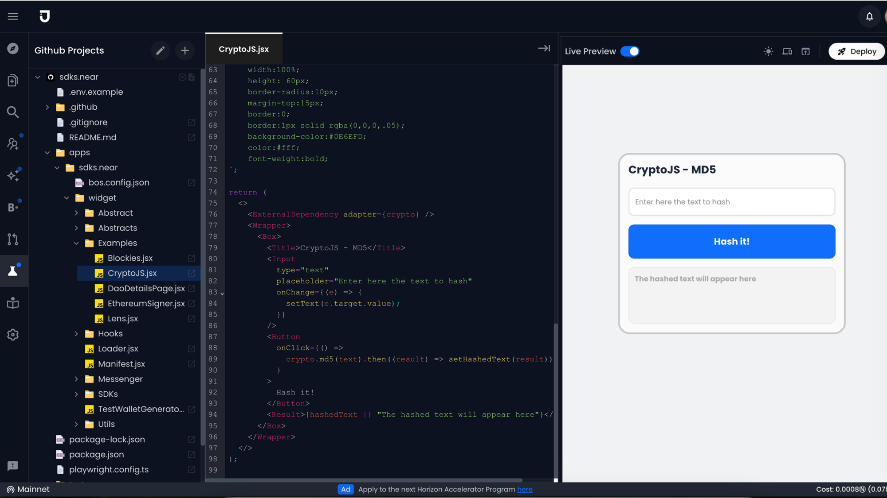

# Jutsu Grant Proposal

- **Project Name:** Mintbase template development experience enhancement with Jutsu
- **Team Name:** Jutsu
- **Payment Address:** jutsuai.near
- **[Level](../README.md#level_slider-levels):** 2

## Project Overview

### Overview

**Mintbase templates** are a compilation of web3 project examples on Near Protocol, providing developers with starter projects and practical use cases. Currently the number of templates are limited and need more community/developer involvement.

**Jutsu** is an AI powered developer platform where developer can leverage our WebIDE and Copilot to build any DApp 10X faster.

The purpose of this project is to build the best developer experience that will empower anyone to build and contribute to Mintbase templates.

Here are the steps (DEVX):

- Step 1: User can search for templates in Mintbase template library (https://templates.mintbase.xyz/) or in Jutsu template library (https://app.jutsu.ai/templates)
- Step 2: When user find a template they want to use the will click “Open in Jutsu” button in Mintbase template library.

- Step 3: User will get a “clone” of the template in their Jutsu account. They will be able to build and deploy there DApp from within Jutsu.

- Step 4: User will be able to deploy their DApp in IPFS, Arweave and NEARFS using Web4
- Step 5: (TBD) User will be able to deploy their DApp as BOS (RoC) in Near Social

> BOS (RoC) implementation depends on the stability and release of the BOS Web Engine by Pagoda team.

### Ecosystem Fit

Jutsu, with our AI powered Web3 IDE, slots perfectly into the Mintbase ecosystem, making it easier for developers and founders to use and deploy Mintbase templates. By incorporating Mintbase's extensive template library directly into Jutsu, we offer a dual advantage:

- Users can now open Mintbase templates within the Jutsu platform, and benefit from our comprehensive suite of developer tools.
- Users will be able to take advantage of Jutsu’s advance WebIDE features like copilot, code generation, debugging, and doc generation, generative UI, and Google Docs-style collaboration for teams.

This strategic integration aims to provide Mintbase users with an effortless start and an enriched coding and deployment experience through Jutsu, ultimately elevating the developer experience within the Mintbase and broader NEAR ecosystem.

Are there any other projects similar to yours in the Mintbase / NEAR ecosystem?

We are not aware of any similar project in the Mintbase/NEAR ecosystem.

## Team:

### Team members

- Zahidul Islam (CEO & Founder)
- Kayleigh Svensson (Growth & Operations)
- Saidul Badhon (Fullstack Engineer)

### Contact

- **Contact Name:** Zahidul Islam
- **Contact Email:** zahid@jutsu.ai
- **Website:** https://jutsu.ai

### Legal Structure

- **Registered Address:** 1007 Orange Street, 4th Floor Suite #1382, Wilmington, DE 19801
- **Registered Legal Entity:** Jutsu Inc.

### Team's experience

We are the team behind Jutsu WebIDE - one of the most used developer tool for BOS component development. We have a proven track record of building and delivering product that developers love.

Our team at Jutsu is composed of professionals with a diverse set of skills and experiences, particularly in the realms of Web3, AI, growth and marketing. Here’s a closer look at our core team members and their contributions:

**Zahidul Islam**, our CEO and Founder, brings over 15 years of data engineering and AI expertise to the table. Previously serving as the VP of Engineering at Cystellar, a SpaceTech company.

**Kayleigh Svensson**, head of Growth and Operations at Jutsu, brings a scientific and analytical edge with her background in biology from Wellesley College (B.S.), and marine biology from the University of Miami (M.S.). Previously a product manager at Open Forest Protocol, her communication and organizational skills amplify our operational and growth strategies.

**Saidul Badhon**, Fullstack Engineer with over 5 years of experience, is passionate about Web3 and Web2 technologies alike. He excels in developing user-centric solutions and is committed to innovation and industry excellence.

### Team Code Repos

- https://github.com/jutsuai
- https://github.com/jutsuai/app.jutsu.ai
- https://github.com/jutsuai/api.jutsu.ai

### Team LinkedIn Profiles

- https://www.linkedin.com/in/zahiduli/
- https://www.linkedin.com/in/kayleigh-svensson/
- https://www.linkedin.com/in/saidulbadhon/

## Development Roadmap

### Overview

- **Total Estimated Duration:** 2 Months
- **Full-Time Equivalent (FTE):** 2 FTE
- **Total Costs:** 30,000 USD

**Milestone 1: Jutsu <> Mintbase Integration - User should be able to open Mintbase template in Jutsu**

**Step 1:** User can search for templates in Mintbase template library (https://templates.mintbase.xyz/) or in Jutsu template library (https://app.jutsu.ai/templates)

**Step 2:** When user find a template they want to use the will click “Open in Jutsu” button in Mintbase template library.

**Step 3:** User will get a “clone” of the template in their Jutsu account. They will be able to build and deploy there DApp from within Jutsu.

- **Estimated duration:** 3 Weeks
- **FTE:** 2
- **Costs:** 11250 USD

**Milestone 2: Template deployment options - User should be able to deploy in IPFS, Arweave and NEARFS using Web4**

Users will be able to deploy DApps not only in Vercel but decentralized storage like **IPFS, Arweave or NEARFS** using Web4.

- **Estimated duration:** 6 Weeks
- **FTE:** 2
- **Costs:** 18750 USD

**Milestone Progress Update**

| Milestone | Progress | Task Completed                                                                                     | Items WIP |
| --------- | -------- | -------------------------------------------------------------------------------------------------- | --------- |
| M1        | 25%      | Jutsu <> Mintbase Integration - User should be able to open Mintbase template                      |           |
| M2        | 0%       | Template deployment options - User should be able to deploy in IPFS, Arweave and NEARFS using Web4 |           |

## Future Plans

We belive templates will play an important role in onboarding new developers. We will collaborate with Mintbase to create more templates for different use cases.
